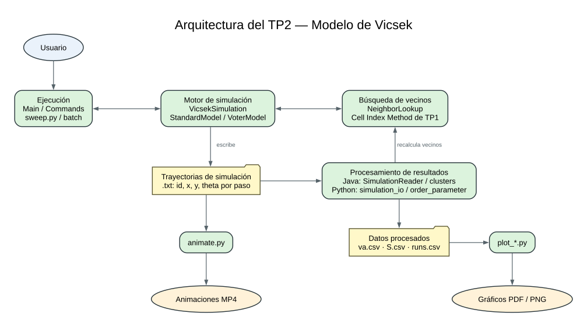
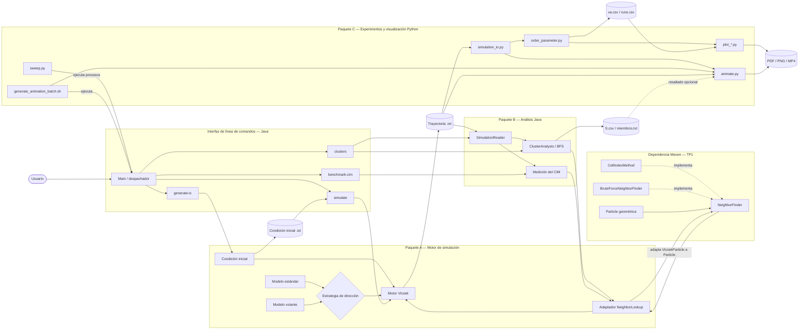
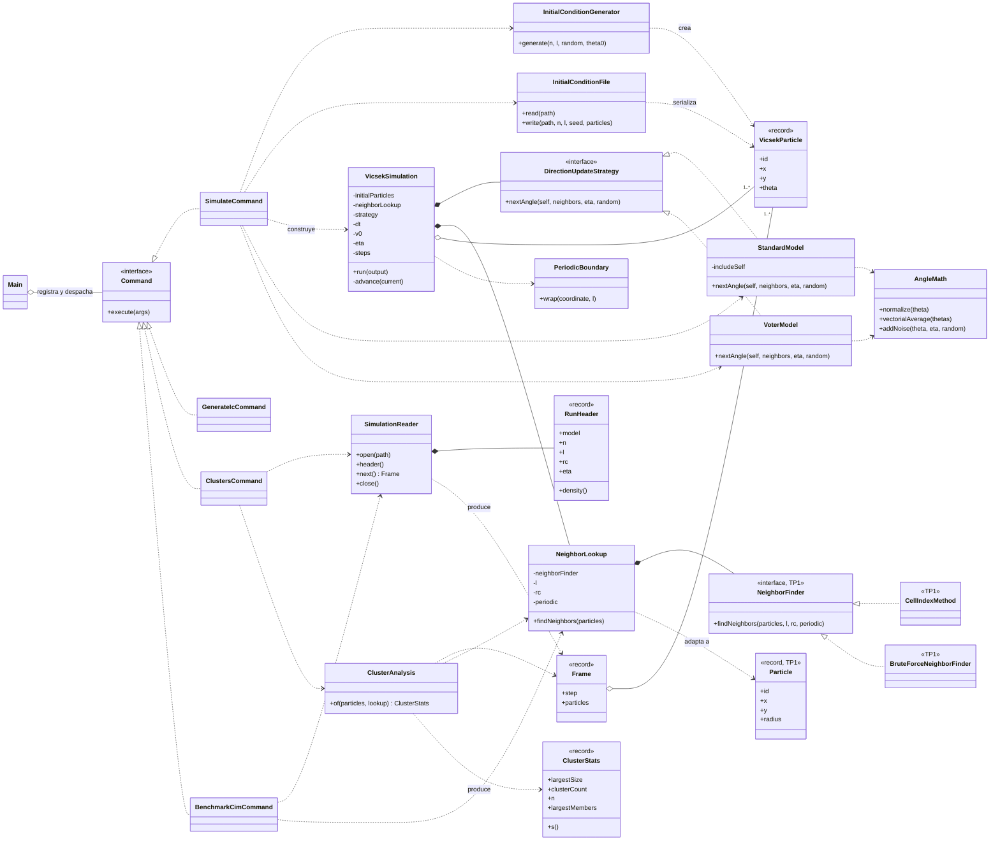

# Arquitectura UML del TP2 — Modelo de Vicsek

Este documento representa la arquitectura implementada actualmente. Separa la vista de
componentes —responsabilidades y flujo de datos— de la vista de clases del núcleo Java.

## 1. Vista simplificada

Esta es la vista recomendada para el informe o la presentación: muestra ejecutables,
archivos intermedios, procesamiento y resultados sin entrar en todas las clases.

## 2. Diagrama de componentes detallado

### Lectura de la arquitectura

- `Main` es el único punto de entrada del JAR y delega en cuatro comandos.
- El **Paquete A** genera o lee la condición inicial, ejecuta la simulación y escribe una
  trayectoria en texto. El algoritmo de actualización angular es intercambiable mediante
  `DirectionUpdateStrategy`.
- `NeighborLookup` es la frontera entre TP2 y TP1. Convierte temporalmente cada
  `VicsekParticle(id, x, y, theta)` en una `Particle(id, x, y, radius=0)` y delega la
  búsqueda geométrica en `NeighborFinder`, normalmente `CellIndexMethod`.
- El **Paquete B** vuelve a leer la trayectoria en streaming. Recalcula el grafo de vecinos
  para obtener clusters por BFS y para medir el rendimiento real del CIM.
- El **Paquete C** consume archivos, no clases Java. Automatiza corridas, calcula el parámetro
  de orden, produce gráficos y renderiza animaciones.
- Los archivos de texto y CSV desacoplan simulación, análisis y visualización: no es necesario
  conservar toda una trayectoria en memoria ni enlazar Python con la JVM.

## 3. Diagrama de clases del núcleo

## 4. Flujo de una simulación

1. `Main` recibe `simulate` y delega en `SimulateCommand`.
2. El comando genera partículas con `InitialConditionGenerator` o las lee mediante
   `InitialConditionFile`.
3. Selecciona `StandardModel` o `VoterModel`, crea un `CellIndexMethod` y lo envuelve en
   `NeighborLookup`.
4. En cada paso, `VicsekSimulation` mueve todas las partículas con su dirección actual.
5. Si el contorno es periódico, `PeriodicBoundary` devuelve las coordenadas a `[0,L)`.
6. `NeighborLookup` convierte la fotografía del sistema al tipo `Particle` de TP1 y pide el
   grafo de vecinos al CIM.
7. La estrategia calcula simultáneamente los nuevos ángulos a partir de esa fotografía y
   agrega ruido mediante `AngleMath`.
8. El motor escribe el nuevo estado en la trayectoria `.txt` y continúa hasta `steps`.
9. Java o Python leen luego esa trayectoria para clusters, métricas, gráficos o animaciones.

## 5. Decisiones de diseño para explicar en una presentación

- **Strategy:** `StandardModel` y `VoterModel` implementan la misma interfaz; el bucle de
  simulación no contiene condicionales dependientes del modelo.
- **Adapter:** `NeighborLookup` permite reutilizar TP1 sin modificar `Particle` ni mezclarla
  con `VicsekParticle`.
- **Command:** cada operación del JAR implementa `Command` y `Main` solo resuelve y ejecuta
  el comando solicitado.
- **Procesamiento en streaming:** `VicsekSimulation` escribe un cuadro por vez y
  `SimulationReader` lo lee del mismo modo, evitando cargar corridas grandes completas.
- **Pipeline basado en archivos:** facilita ejecutar experimentos por lotes, repetir análisis
  sin recalcular simulaciones y mantener desacoplados Java y Python.
