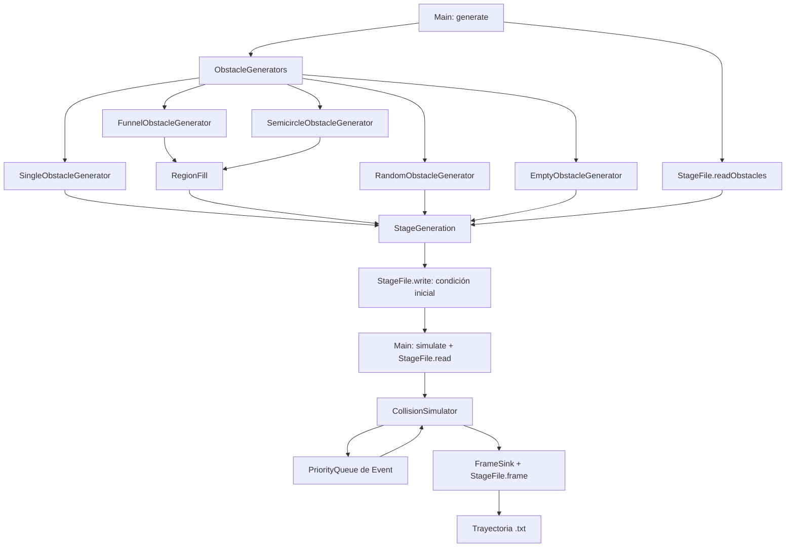

# Motor de TP3: archivos, lógica y estructuras de datos

Este documento explica la implementación actual del motor de billar-metegol.
Para compilar y ejecutar, consultar también [README.md](README.md).
Las unidades son metros, segundos y kilogramos.

## 1. Organización general

El motor tiene dos etapas independientes:

1. **Generar:** elegir los obstáculos, ubicar las partículas y guardar la condición inicial.
2. **Simular:** leer esa condición, calcular las colisiones y guardar la trayectoria.

La separación permite ejecutar varias simulaciones desde el mismo estado inicial,
cambiar el algoritmo de obstáculos sin tocar las colisiones y usar los archivos
resultantes en un programa de análisis o animación.



Las clases Java están bajo `src/main/java/ar/edu/itba/sds/tp3/`.
Los tres modelos del problema son `Particle`, `Obstacle` y `Event`.
Además se utilizan pequeños contenedores de configuración y resultados.

## 2. Qué hay en cada archivo de producción

### `Main.java`: entrada por línea de comandos

[Ver código](src/main/java/ar/edu/itba/sds/tp3/Main.java).

Interpreta los comandos `generate` y `simulate`. No contiene las fórmulas físicas.

- `main(args)` llama a `execute(args)` y convierte errores de entrada o de archivos
  en un mensaje y un código de salida 1.
- `execute(args)` valida nombres de opciones, opciones repetidas y pares
  `--opción valor`. Luego organiza las llamadas a las clases del motor.
- `value(...)` convierte una opción numérica o usa su valor predeterminado.
- `output(...)` resuelve el archivo de salida. Sin `--out`, busca el módulo TP3
  desde la ubicación de las clases compiladas o del JAR y utiliza su `generated/`.

En `generate`, construye la configuración, obtiene obstáculos desde un algoritmo
o desde un archivo, genera las partículas y escribe el estado inicial.
El algoritmo por defecto es `random`, con dos obstáculos de radio 0.05 m.
Las opciones `--obstacle-*` (salvo `--obstacle-algorithm`) se pasan a la fábrica sin
el prefijo; cada algoritmo valida las suyas. Con `--obstacles-out` escribe además los
obstáculos en el formato de competencia, solo si la generación completa tuvo éxito.

En `simulate`, lee el estado, crea el simulador y conecta su salida con el escritor
de texto. Impide usar el mismo archivo como entrada y salida. Al terminar escribe
un comentario con tiempo final, frecuencia de escritura, eventos, goles, t90 y el
tiempo real del ciclo de eventos (`runtime`, medido con `System.nanoTime`).

Utiliza un `Set<String>` para las opciones admitidas y un `HashMap<String, String>`
para los valores recibidos. Así puede buscar una opción por nombre sin depender
del orden en que se escribió en la terminal.

### `models/Particle.java`: estado de un disco móvil

[Ver código](src/main/java/ar/edu/itba/sds/tp3/models/Particle.java).

| Campo | Significado | ¿Cambia durante la simulación? |
|---|---|---|
| `id` | Identificador de la partícula | No |
| `radius`, `mass` | Radio y masa | No |
| `x`, `y` | Coordenadas del centro | Sí |
| `vx`, `vy` | Componentes de velocidad | Sí, al colisionar |
| `used` | Si ya tocó un arco | Una vez: de `false` a `true` |
| `collisions` | Cantidad de colisiones de esa partícula | Sí |

Es una clase mutable porque posiciones y velocidades evolucionan.
El constructor rechaza valores no finitos, radios o masas no positivos e IDs negativos.
La validación respecto de paredes y otros discos se realiza en `StageGeneration`.

`move(dt)` aplica movimiento rectilíneo uniforme: `x += vx*dt`, `y += vy*dt`.
`setVelocityAfterCollision(vx, vy)` actualiza la velocidad e incrementa el contador.
`markUsed()` marca la partícula como usada y devuelve `true` solamente la primera
vez: ese resultado permite sumar un único gol.

`copy()` crea otra partícula con la misma geometría, velocidad y estado de uso;
su contador de colisiones empieza en cero. El simulador utiliza copias para no
alterar las partículas de la condición inicial entregada al constructor.

El color no se almacena como tres campos: se deriva de `used` al escribir el archivo.

### `models/Obstacle.java`: disco fijo

[Ver código](src/main/java/ar/edu/itba/sds/tp3/models/Obstacle.java).

Es un `record` con `x`, `y` y `radius`. No tiene velocidad ni masa almacenada:
la resolución de choques lo trata como fijo y de masa infinita.

Los componentes de un `record` son finales. En este caso todos son valores
primitivos, de modo que el obstáculo es inmutable. El constructor valida valores
finitos y radio positivo. Su posición dentro del mapa y sus solapamientos se
validan posteriormente.

### `models/Event.java`: predicción de una colisión

[Ver código](src/main/java/ar/edu/itba/sds/tp3/models/Event.java).

Es un `record` que implementa `Comparable<Event>` y contiene:

| Campo | Uso |
|---|---|
| `time` | Tiempo absoluto en que ocurriría el choque |
| `type` | Tipo de colisión, representado por un `enum` |
| `a` | Partícula involucrada, siempre presente en los eventos del motor |
| `b` | Segunda partícula, solamente en choques entre partículas |
| `obstacle` | Obstáculo involucrado, solamente en ese tipo de choque |
| `countA`, `countB` | Contadores de colisiones capturados al crear el evento |
| `sequence` | Orden de inserción para desempatar tiempos iguales |

Los tipos son `PARTICLE`, `OBSTACLE`, `VERTICAL_WALL` y `HORIZONTAL_WALL`.
Las paredes se representan mediante el tipo de evento y las dimensiones del
rectángulo; no requieren objetos adicionales.

`compareTo` ordena primero por `time` y luego por `sequence`.
`valid()` compara los contadores guardados con los actuales de las partículas.
Si alguna ya colisionó, la predicción dejó de ser válida.

Aunque el registro no cambia sus campos, conserva referencias a partículas
mutables: eso permite observar sus contadores actuales. No es una copia del
estado completo del sistema.

### `engine/SimulationConfig.java`: parámetros físicos

[Ver código](src/main/java/ar/edu/itba/sds/tp3/engine/SimulationConfig.java).

Es un `record` con largo, ancho, longitud del arco, radio, masa y rapidez inicial.
`defaults()` devuelve los valores del enunciado: 1.20 m, 0.68 m, 0.20 m,
0.0175 m, 0.025 kg y 1 m/s, respectivamente.

Valida dimensiones, radio y masa positivos; rapidez no negativa; arco compatible
con el ancho; y tamaño de partícula compatible con el dominio. Los parámetros
pueden modificarse al generar el estado inicial y quedan escritos en su cabecera.

### `engine/StageGeneration.java`: construcción del mapa inicial

[Ver código](src/main/java/ar/edu/itba/sds/tp3/engine/StageGeneration.java).

Recibe obstáculos ya elegidos. No conoce qué algoritmo los produjo.
`generate(config, n, seed, obstacles)` sigue esta secuencia:

1. Rechaza N no positivo y valida los obstáculos.
2. Crea un `Random` con la semilla de partículas.
3. Sortea el centro de una partícula en `[r, L-r)` × `[r, W-r)`.
4. Rechaza la posición si se solapa con un obstáculo o una partícula ya ubicada.
5. Si acepta la posición, sortea un ángulo uniforme en `[0, 2π)` y calcula
   `vx = v0*cos(ángulo)`, `vy = v0*sin(ángulo)`.
6. Repite hasta completar N partículas y devuelve un `Stage`.

Es **muestreo por rechazo secuencial**: cada centro aceptado es uniforme sobre
el espacio disponible dado lo ya colocado. No implica muestreo uniforme de todas
las configuraciones colectivas posibles de N discos.

Cada partícula tiene un máximo de 100000 intentos. Si se agota, se lanza un error;
no se guarda un mapa incompleto ni se afirma que sea imposible ubicarla con otro método.

`validate(...)` comprueba límites del rectángulo, obstáculos de radio ≥ r,
IDs únicos y ausencia de solapamientos entre todos los tipos de discos.
La condición de solapamiento es `distanciaEntreCentros < sumaDeRadios`.
El contacto exacto está permitido.

El `record Stage` agrupa `config`, `seed`, `particles` y `obstacles`.
Utiliza `List.copyOf` para impedir agregar o quitar elementos de las listas,
pero **las partículas contenidas siguen siendo mutables**. No es una copia profunda.

### `engine/obstacles/ObstacleGenerator.java`: contrato para algoritmos

[Ver código](src/main/java/ar/edu/itba/sds/tp3/engine/obstacles/ObstacleGenerator.java).

Es una interfaz funcional con un único método:

```java
List<Obstacle> generate(SimulationConfig config, long seed);
```

Cualquier algoritmo nuevo debe devolver una lista de obstáculos usando ese
contrato. Puede recibir parámetros particulares mediante su constructor.
Esta separación corresponde al patrón de estrategia: el consumidor trabaja con
una interfaz común y puede intercambiar la implementación.

### `engine/obstacles/RandomObstacleGenerator.java`: obstáculos aleatorios

[Ver código](src/main/java/ar/edu/itba/sds/tp3/engine/obstacles/RandomObstacleGenerator.java).

Recibe cantidad y radio en el constructor. Para cada obstáculo, sortea un centro
uniforme dentro del rectángulo reducido por su radio y rechaza solapamientos
con obstáculos anteriores. Todos tienen el mismo radio en este algoritmo.

Usa un `ArrayList<Obstacle>` mientras construye el resultado y devuelve
`List.copyOf(...)` al terminar. Limita a 100000 intentos por obstáculo.
Valida cantidad positiva, radio finito y positivo, radio ≥ r y que el disco quepa.

No coloca partículas ni garantiza por sí solo que luego entren las N partículas:
esa segunda etapa corresponde a `StageGeneration`.

### `engine/obstacles/EmptyObstacleGenerator.java`: mesa vacía

[Ver código](src/main/java/ar/edu/itba/sds/tp3/engine/obstacles/EmptyObstacleGenerator.java).

Implementa el mismo contrato y devuelve `List.of()`, una lista vacía inmodificable.
Sirve para las corridas sin obstáculos y la comparación con otras configuraciones.
Se selecciona con `--obstacle-algorithm none`.

### `engine/obstacles/SingleObstacleGenerator.java`: un obstáculo

[Ver código](src/main/java/ar/edu/itba/sds/tp3/engine/obstacles/SingleObstacleGenerator.java).

Devuelve un único obstáculo en (x, y) con el radio indicado. Una coordenada `NaN`
(el valor por defecto desde la CLI) se reemplaza por el centro de la mesa, que se
conoce recién en `generate`. La validez del disco la comprueba `StageGeneration`.

### `engine/obstacles/RegionFill.java`: relleno de una región bloqueada

[Ver código](src/main/java/ar/edu/itba/sds/tp3/engine/obstacles/RegionFill.java).

Recibe una `Region`, interfaz funcional con `distanceToFree(x, y)`: distancia a la
zona libre, positiva dentro de la región a bloquear y ≤ 0 fuera de ella.
Una partícula de radio r puede tener su centro en p si p está a distancia ≥ r de las
paredes y `|p - c_k| ≥ R_k + r` para todo obstáculo. El objetivo es que ningún punto
de la región bloqueada cumpla eso: si no, podría nacer ahí una partícula atrapada.

Para cada punto candidato de una grilla se guardan dos cotas del radio de un disco
centrado en él: `limit = min(pared, max(r, distanciaALaZonaLibre), maxRadius)` y
`clearance = min_k(|p - c_k| - R_k)`. En cada paso se elige el candidato con mayor
`min(limit, clearance)`, se coloca ese disco (menos 1e-9 para evitar tangencias
exactas por redondeo), se actualiza `clearance` de los demás y se descartan los que
ya no admiten un disco de radio r: tampoco admiten el centro de una partícula.
Termina cuando no quedan candidatos. Cada disco tiene radio ≥ r por construcción.

Permitir invadir la zona libre hasta r evita dejar una ranura de ancho menor que r
entre la zona libre y los discos. La grilla incluye las rectas extremas `x = r`,
`x = L - r`, `y = r`, `y = W - r` (desplazadas 2e-9), donde se forman bolsillos
contra las paredes. Se hacen tres pasadas, con pasos grid, grid/2 y grid/4, cada una
partiendo de los discos ya colocados, para cubrir huecos más chicos que la grilla.

Es un algoritmo voraz tipo empaquetamiento apoloniano: produce pocos discos grandes
y rellenos más chicos en los intersticios. Es determinista. Con paso 1 mm el costo
está dominado por la grilla de 0.25 mm: unos 13 millones de puntos, cada uno con
evaluación temprana contra los discos ya colocados. La generación tarda alrededor de un segundo.

### `engine/obstacles/FunnelObstacleGenerator.java`: embudos hacia los arcos

[Ver código](src/main/java/ar/edu/itba/sds/tp3/engine/obstacles/FunnelObstacleGenerator.java).

La región bloqueada son las cuatro esquinas detrás de las rectas que unen cada palo
`(0, (W+d)/2)` con `(a, W)`, y sus simétricas, donde `a` es el largo del embudo.
Por simetría, cada punto se lleva a la esquina superior izquierda con
`x' = min(x, L-x)`, `y' = max(y, W-y)`. Está bloqueado si queda del lado de la esquina
según el producto vectorial con la recta; su distancia a la zona libre es la distancia
al segmento palo–pared. Exige `a ≤ L/2` para que las esquinas no se superpongan.

Con `edgeRadius` (`--obstacle-edge-radius`), antes del relleno coloca sobre cada segmento
palo–pared una cadena de discos de ese radio centrados en la recta: desde donde el disco
toca la pared corta (`x = ρ`) hasta donde toca la larga (`y = W - ρ`), a 1e-9 m de ellas
por redondeo. Usa la mayor cantidad de discos que no se solapan, equiespaciados, y verifica
que los huecos entre ellos sean menores que 2r. Después rellena el interior de las esquinas
con `RegionFill`, que recibe la cadena como obstáculos existentes y queda detrás de ella:
todo disco que asoma a la cancha es de radio ρ.

### `engine/obstacles/SemicircleObstacleGenerator.java`: semicírculo libre

[Ver código](src/main/java/ar/edu/itba/sds/tp3/engine/obstacles/SemicircleObstacleGenerator.java).

La zona libre son los puntos a distancia ≤ R_libre del centro del arco derecho
`(L, W/2)`; `distanceToFree = |p - (L, W/2)| - R_libre`. Con R_libre = 0.36 m = 0.3 L
se bloquea el 70 % izquierdo del largo, incluido el arco izquierdo. Si R_libre > W/2,
el semicírculo queda recortado por las paredes largas.

Con `centerOffset` s (`--obstacle-center-offset`) el centro pasa a `(L - s, W/2)` (y `(s, W/2)`
en el arco izquierdo): la zona libre es más que un semicírculo y su pared se cierra detrás del
arco. Se exige `√(s² + (d/2)²) < R_libre`, es decir que ambos palos sigan dentro de la zona
libre; si no, el círculo empieza a bloquear el arco y el generador lo rechaza.

Con `edgeRadius` ρ (`--obstacle-edge-radius`), antes del relleno se coloca sobre cada
circunferencia una cadena de discos de radio ρ con `DiscChain`, igual que el borde de la elipse:
se muestrea la circunferencia con 20000 puntos y cada tramo donde un disco de radio ρ entra en la
mesa se cubre con la mayor cantidad de discos que no se solapan, con huecos menores que 2r. La
cara interna de la cadena queda a R_libre − ρ del centro. `RegionFill` rellena después detrás de
la cadena. Con ambos arcos se exige que las dos cadenas no se toquen.

### `engine/obstacles/PostsObstacleGenerator.java`: palos

[Ver código](src/main/java/ar/edu/itba/sds/tp3/engine/obstacles/PostsObstacleGenerator.java).

Cuatro discos de radio R en `(R, W/2 ± (d/2 + R))` y `(L - R, W/2 ± (d/2 + R))`: tangentes
a la pared corta y con su punto más bajo o más alto a la altura del palo.

### `engine/obstacles/LatticeObstacleGenerator.java`: red de Galton

[Ver código](src/main/java/ar/edu/itba/sds/tp3/engine/obstacles/LatticeObstacleGenerator.java).

Discos de radio ρ (r por defecto) en una red triangular de lado s: columnas en
`x = L/2 + k·s√3/2`, con discos en `y = W/2 + (j + |k| mod 2 · 1/2)·s`. Todo disco queda a
distancia s de sus seis vecinos y la red es simétrica respecto de ambos ejes de la mesa.
Exige `s - 2ρ > 2r` (con tolerancia relativa 1e-6): si el paso entre vecinos fuera 2r,
cada celda de la red quedaría cerrada. Por la misma razón omite los discos a menos de
2r de una pared o de un obstáculo existente.

### `engine/obstacles/EllipseObstacleGenerator.java` y `DiscChain.java`: mesa elíptica

[Ver código](src/main/java/ar/edu/itba/sds/tp3/engine/obstacles/EllipseObstacleGenerator.java).

Elipse centrada en (L/2, W/2) con semieje mayor a = L/2, es decir con vértices en los arcos,
y focos en `x = focusX` y `x = L - focusX`: c = L/2 - focusX y b = √(a² - c²). Con los valores
por defecto (focos en 0.3 y 0.9), b ≈ 0.52 > W/2 y la elipse solo recorta las esquinas.
Propiedad usada: una trayectoria que pasa por un foco rebota en el borde y pasa por el otro.

El borde se muestrea con 20000 puntos; los tramos donde un disco de radio ρ cabe en la mesa
forman las cadenas de `DiscChain`. Cerca de los vértices la elipse está a menos de ρ de la
pared corta, así que la boca del arco queda libre. El exterior de la elipse, y el interior
de las lentes, se rellenan con `RegionFill`. La distancia de un punto a la elipse se calcula
con el método de bisección de Eberly (`distance`), que es exacto hasta el redondeo.

Objetos por foco: `DISC`, un disco de radio focusSize centrado en el foco; `LINE`, una cadena
vertical de semilargo focusSize; `LENS`, la intersección de dos círculos de radio
R = (h² + w²)/(2w) centrados en `fx ± (R - w)`, con contorno de discos e interior relleno.

`DiscChain.along` reparte n discos uniformemente por longitud de arco sobre una polilínea
abierta o cerrada. Empieza con el mayor n posible y lo reduce hasta que ningún par de discos
se solapa; si para lograrlo un hueco entre discos consecutivos llega a 2r, falla, porque una
partícula podría atravesar la cadena. Esto ocurre, por ejemplo, con lentes muy finas y altas,
cuyas puntas son demasiado agudas.

### Combinación con obstáculos existentes

`ObstacleGenerator` tiene además `generate(config, seed, existing)`, que devuelve solo
los obstáculos nuevos. Por defecto ignora `existing`. `RandomObstacleGenerator` rechaza
posiciones que solapan con ellos; `FunnelObstacleGenerator` y `SemicircleObstacleGenerator`
se los pasan a `RegionFill.fill(..., existing)`, que parte de ellos al calcular holguras.
`Main` usa los obstáculos de `--obstacles` como base cuando también se indica
`--obstacle-algorithm`.

### `engine/obstacles/ObstacleGenerators.java`: selección por nombre

[Ver código](src/main/java/ar/edu/itba/sds/tp3/engine/obstacles/ObstacleGenerators.java).

Es una fábrica sencilla: `create(name, params)` recibe el nombre y un mapa de
opciones sin el prefijo `--obstacle-`. Un primer `switch` define las opciones que
acepta cada algoritmo y rechaza las demás; un segundo instancia `random`, `none`,
`single`, `funnel`, `semicircle` o `posts` con sus valores por defecto. Rechaza nombres
desconocidos. Este es el punto donde se registra un algoritmo nuevo para la CLI.
No utiliza reflexión ni descubrimiento automático de clases.

### `engine/CollisionSimulator.java`: ejecución de la dinámica

[Ver código](src/main/java/ar/edu/itba/sds/tp3/engine/CollisionSimulator.java).

Mantiene la configuración, copias de las partículas, los obstáculos, una cola
de eventos, el reloj actual y el tiempo límite.
Cada instancia puede ejecutar `run(...)` una sola vez.

Sus métodos principales son:

| Método | Responsabilidad |
|---|---|
| `run(endTime, outputEvery, output)` | Coordinar el ciclo de eventos y calcular resultados |
| `run(endTime, outputEvery, outputInterval, output)` | Igual, pero con `outputInterval > 0` escribe en t = k·outputInterval |
| `advance(next)` | Mover todas las partículas hasta el nuevo tiempo |
| `predict(p, skip)` | Predecir choques de p contra paredes, partículas y obstáculos |
| `add(...)` | Insertar predicciones finitas dentro del tiempo de simulación |
| `wallTime(...)` | Calcular tiempo restante hasta una pared |
| `collisionTime(...)` | Resolver el encuentro de dos discos a velocidad relativa constante |
| `bounce(a, b)` | Aplicar el impulso elástico a dos partículas |

Incluye dos tipos auxiliares:

- `FrameSink`: interfaz funcional a la que entrega cada estado que debe escribirse.
  Desacopla la simulación del formato de archivo. Recibe las partículas vivas;
  quien quiera conservar un fotograma en memoria debe copiar sus valores.
- `Result`: registro con tiempo final, cantidad de eventos, goles y t90.

Los detalles del ciclo y las fórmulas se explican en las secciones siguientes.

### `io/StageFile.java`: entrada y salida de texto

[Ver código](src/main/java/ar/edu/itba/sds/tp3/io/StageFile.java).

Centraliza el formato `tp3-v1`:

- `writer(path)` crea los directorios necesarios y abre un `BufferedWriter`.
- `header(...)` escribe parámetros y obstáculos.
- `frame(...)` escribe tiempo, eventos, goles, fracción usada y filas de partículas.
- `write(...)` guarda una condición inicial de un único bloque t=0.
- `writeObstacles(...)` guarda obstáculos en el formato de competencia `x y radio`.
- `read(...)` reconstruye esa condición usando `BufferedReader`, valida formato,
  columnas, colores y geometría. No es un lector de trayectorias completas ni
  permite reiniciar desde un bloque de tiempo arbitrario.
- `readObstacles(...)` lee el formato de competencia `x y radio`, aceptando
  comentarios `#` y líneas vacías. En este método el archivo se carga completo
  mediante `Files.readAllLines`; está pensado para configuraciones pequeñas.

Los auxiliares `fields`, `tokens` y `number` separan campos y convierten valores.
Las cabeceras se almacenan temporalmente en un `HashMap<String, String>`.
La escritura de trayectorias es incremental: no acumula todos los estados en memoria.

## 3. Cómo funciona el ciclo de eventos

El reloj no aumenta con un dt fijo. Aumenta hasta el próximo choque válido.

```text
escribir estado inicial
predecir eventos de todas las partículas
mientras haya eventos:
    sacar el evento de menor tiempo
    si está invalidado, descartarlo
    avanzar todas las partículas hasta ese tiempo
    resolver el choque y actualizar contadores
    actualizar goles y t90
    predecir nuevos choques de los participantes
    si corresponde por la frecuencia, escribir el estado
avanzar hasta el tiempo final si falta
escribir el estado final si aún no quedó escrito
```

Con salida por intervalo (`--dt`), antes de resolver cada evento se escriben las
muestras pendientes `k·dt ≤ tiempoDelEvento`: se copian las partículas, se avanzan las
copias hasta la muestra y se escriben. No se avanza el sistema real: partir un tramo en
dos cambia el redondeo, y en un sistema caótico eso altera la trayectoria y t90. Como entre eventos el movimiento es rectilíneo uniforme, esos estados son
exactos. Una muestra que coincide con un evento muestra el estado previo al choque.
Los tiempos se calculan como `k·dt`, sin acumular sumas, para evitar deriva.

Solamente se insertan eventos cuyo tiempo no supera el límite de la corrida.
Por eso, al vaciarse la cola se puede avanzar directamente al tiempo final.
La simulación sigue hasta ese límite aunque ya se haya alcanzado t90.

### Invalidación perezosa: por qué hace falta el contador

Supongamos que se predijo un choque A–B a t=2 y un choque A–pared a t=1.
Al llegar a t=1, A rebota y cambia su velocidad. El evento A–B había sido
calculado con la velocidad anterior y ya no describe el futuro del sistema.

En vez de buscarlo y eliminarlo inmediatamente de la cola, se incrementa el
contador de A. Al extraer A–B, su contador guardado no coincide con el actual,
por lo que `valid()` devuelve `false` y el evento se descarta sin avanzar el reloj.

La predicción inicial puede incluir tanto A–B como B–A. Al resolver el primero,
los contadores invalidan el duplicado. Después de un choque de dos partículas,
`skip` evita recalcular dos veces ese par dentro de esa actualización.

Para reducir memoria retenida, si el tamaño de la cola supera
`8 * N * (N + K + 2)`, se eliminan los eventos que ya son inválidos.
Es un umbral de limpieza, no un máximo rígido del tamaño de la cola.

## 4. Predicción y resolución física

El modelo sigue el [enunciado](enunciado/TP3_Enunciado.pdf) y el material local
[Molecular Dynamics Simulation of Hard Spheres](<enunciado/Molecular Dynamics Simulation of Hard Spheres.pdf>).
No se agrega una fuerza propulsora continua: la rapidez inicial es v0 y luego
las velocidades evolucionan mediante choques elásticos.

### Paredes

Para una coordenada `q`, velocidad `u`, radio `r` y dimensión `S`:

```text
si u > 0: dt = (S - r - q) / u
si u < 0: dt = (r - q) / u
si u = 0: no hay choque con esas paredes
```

Una pared vertical invierte vx; una horizontal invierte vy.
El componente tangencial no cambia.

### Dos discos

Sean `dr = posiciónB - posiciónA`, `dv = velocidadB - velocidadA` y
`sigma = radioA + radioB`. Se busca el primer contacto:

```text
|dr + dv*dt|² = sigma²
vr = dr · dv
vv = dv · dv
gap = dr · dr - sigma²
D = vr² - vv*gap
```

No se programa impacto si se separan (`vr >= 0`), si no tienen velocidad
relativa (`vv == 0`) o si `D <= 0`. La tangencia exacta no tiene impulso normal.
Para los demás casos se utiliza la raíz menor racionalizada:

```text
dt = gap / (-vr + sqrt(D))
```

Es algebraicamente equivalente a `(-vr - sqrt(D))/vv`, pero evita restar
cantidades cercanas cuando las superficies están próximas al contacto.
Para un obstáculo se usa velocidadB=0 y su radio.

En el choque entre partículas, con `dr` evaluado en el contacto:

```text
factor = 2*mA*mB*(dv · dr) / ((mA+mB)*(dr · dr))
vA_nueva = vA + factor*dr/mA
vB_nueva = vB - factor*dr/mB
```

El impulso actúa sobre la línea de centros. Conserva energía cinética y momento
lineal del par. No se restablece artificialmente la rapidez a v0.

Para un obstáculo, con `d = posiciónPartícula - centroObstáculo`:

```text
v_nueva = v - 2*(v · d)/(d · d) * d
```

Esto invierte la componente normal y conserva la tangencial y la rapidez.
El obstáculo permanece fijo.

### Arcos y goles

En un choque con pared vertical se evalúa `abs(y - W/2) <= d/2`.
Si pertenece al arco y `markUsed()` devuelve `true`, se incrementa `Ng`.
La partícula sigue dentro del sistema y rebota normalmente.

`Fu = Ng/N`. El primer evento que alcanza `Ng >= ceil(0.9*N)` define t90.
Se calcula en cada colisión válida, independientemente de qué estados se impriman.
Si no se alcanza, el resultado es `NaN`.

### Contactos simultáneos y precisión

`add` acepta tiempos restantes ligeramente negativos hasta -1e-10 s y los
lleva a cero para absorber redondeo cerca del contacto. Esto también permite
resolver las dos paredes de una esquina sin saltarse el segundo rebote.

Los eventos con el mismo tiempo se procesan secuencialmente por orden de inserción.
No hay un solucionador colectivo para impactos de tres o más cuerpos; es la
simplificación del material de referencia. Las pruebas comparan valores con
tolerancias porque la aritmética utiliza `double`.

## 5. Estructuras de datos y costo

| Estructura | Dónde se usa | Motivo |
|---|---|---|
| `PriorityQueue<Event>` | Simulador | Extraer el próximo evento por tiempo sin ordenar toda la colección |
| `ArrayList<Particle>` | Generación y lectura | Construir secuencialmente la lista y recorrer partículas |
| `ArrayList<Obstacle>` | Generadores y lectura | Agregar obstáculos aceptados y recorrer los anteriores |
| `List.copyOf`, `List.of`, `Stream.toList` | Resultados y estado del motor | Mantener fija la composición de las listas |
| `HashSet<Integer>` | Validación del mapa | Detectar IDs repetidos |
| `Set<String>` | Parser de comandos | Comprobar nombres de opciones admitidas |
| `HashMap<String, String>` | Opciones y cabeceras | Consultar valores por nombre |
| `Random` | Generación | Reproducir sorteos con una semilla |
| `record` | Obstáculos, eventos, configuración, Stage y Result | Agrupar datos con campos finales y accesores |
| `enum Event.Type` | Eventos | Restringir los tipos posibles de choque |
| `BufferedReader` / `BufferedWriter` | Archivos | Reducir operaciones de E/S al leer o escribir texto |

La cola de prioridad de Java se basa en un heap: insertar y extraer el mínimo
cuesta O(log Q), donde Q es la cantidad de eventos encolados. No debe interpretarse
su iteración interna como una lista completamente ordenada.

Con N partículas y K obstáculos:

- La generación de partículas hace O(N+K) comprobaciones por candidato en el
  peor punto de la construcción; los rechazos aumentan el trabajo en mapas densos.
- La generación aleatoria de obstáculos hace O(K) comprobaciones por candidato.
- La validación completa del mapa cuesta O(N² + NK + K²).
- La predicción inicial evalúa O(N² + NK) posibles choques, más las inserciones
  correspondientes en la cola.
- Cada evento válido mueve N partículas y recalcula O(N+K) predicciones por
  participante. Cada inserción añade el costo O(log Q).
- Cada evento inválido extraído también tiene costo de cola, aunque no produzca
  movimiento ni escritura. La limpieza periódica recorre los eventos encolados.
- Escribir un fotograma cuesta O(N). La memoria de trabajo no crece con la cantidad
  total de fotogramas: se mantienen partículas, obstáculos y eventos pendientes.

No se usa todavía una grilla de celdas, árbol espacial ni índice de vecinos.
Las búsquedas de posibles choques recorren todas las partículas y obstáculos.

## 6. Agregar y elegir otro algoritmo de obstáculos

Para cambiar la lógica aleatoria actual, editar solamente
`RandomObstacleGenerator.java`. Para conservarla y comparar con otro algoritmo,
crear una implementación distinta de `ObstacleGenerator`.

Por ejemplo, esta clase produciría un obstáculo central con radio configurable:

```java
package ar.edu.itba.sds.tp3.engine.obstacles;

import ar.edu.itba.sds.tp3.engine.SimulationConfig;
import ar.edu.itba.sds.tp3.models.Obstacle;
import java.util.List;

public final class CentralObstacleGenerator implements ObstacleGenerator {
    private final double radius;

    public CentralObstacleGenerator(double radius) {
        this.radius = radius;
    }

    @Override
    public List<Obstacle> generate(SimulationConfig config, long seed) {
        return List.of(new Obstacle(config.length()/2, config.width()/2, radius));
    }
}
```

Este ejemplo es ilustrativo: esa clase **no está agregada al motor actual**
(`single` ya cubre ese caso). Para habilitarla habría que guardarla en su archivo,
agregar su nombre a `ObstacleGenerators.NAMES` y un caso a cada `switch` de
`ObstacleGenerators.create`:

```java
case "central" -> Set.of("radius");                                            // opciones aceptadas
case "central" -> new CentralObstacleGenerator(number(params, "radius", "0.1")); // instancia
```

Si necesita opciones nuevas, se agregan `--obstacle-<nombre>` al conjunto de opciones
admitidas de `Main` y a la ayuda; la generación de partículas y `CollisionSimulator`
no cambian. Para bloquear una zona con forma arbitraria basta con escribir su
`RegionFill.Region` y llamar a `RegionFill.fill`, como hacen `funnel` y `semicircle`.

Los algoritmos actuales se eligen así, desde la raíz del repositorio:

```bash
# Dos obstáculos aleatorios por defecto.
java -jar TP3/target/tp3.jar generate --seed 42

# Configuración de obstáculos fija, semilla de partículas independiente.
java -jar TP3/target/tp3.jar generate --obstacle-algorithm random --obstacle-count 3 --obstacle-radius 0.04 --obstacle-seed 17 --seed 1

# Mesa vacía.
java -jar TP3/target/tp3.jar generate --obstacle-algorithm none

# Un obstáculo grande sobre el eje longitudinal.
java -jar TP3/target/tp3.jar generate --obstacle-algorithm single --obstacle-x 0.4 --obstacle-radius 0.15

# Embudos hacia los arcos y semicírculo libre junto al arco derecho, guardando la configuración.
java -jar TP3/target/tp3.jar generate --obstacle-algorithm funnel --obstacle-funnel-length 0.3 --obstacles-out TP3/configs/funnel.txt
java -jar TP3/target/tp3.jar generate --obstacle-algorithm semicircle --obstacle-free-radius 0.36 --obstacles-out TP3/configs/semicircle_70.txt

# Configuración definida a mano o guardada por una exploración anterior.
java -jar TP3/target/tp3.jar generate --obstacles TP3/configs/central.txt
```

`--obstacles` excluye las opciones `--obstacle-*`. Si se omite `--obstacle-seed`,
se usa el valor de `--seed`, pero cada etapa tiene su propia instancia de `Random`.
Para comparar distintas realizaciones sobre los mismos obstáculos, fijar
`--obstacle-seed` y variar `--seed`.

## 7. Archivos de datos, compilación y documentación

| Archivo | Contenido y función |
|---|---|
| [configs/central.txt](configs/central.txt) | Un obstáculo de ejemplo en `(0.60, 0.34)` con radio `0.08`; cada fila usa `x y radio`. No es una configuración optimizada. |
| [configs/funnel.txt](configs/funnel.txt) | Salida de `funnel` con largo 0.30 m: 28 discos en las cuatro esquinas. |
| [configs/semicircle_70.txt](configs/semicircle_70.txt) | Salida de `semicircle` con radio libre 0.36 m: 31 discos que cubren el 70 % izquierdo. |
| [pom.xml](pom.xml) | Compilación Java 21, JUnit 5, ejecución de pruebas con Surefire y creación de `target/tp3.jar` con `Main` como entrada. Se modificó la configuración Maven existente. |
| [README.md](README.md) | Guía operativa: estructura, comandos, formato y decisiones principales. |
| [MOTOR.md](MOTOR.md) | Este documento explicativo. |
| `target/tp3.jar` | Ejecutable generado por Maven; se regenera, no es código fuente. |
| `generated/initial.txt` | Condición inicial producida por `generate`: cabecera, obstáculos y un bloque t=0. |
| `generated/simulation.txt` | Trayectoria producida por `simulate`: cabecera, obstáculos, múltiples bloques y resultado final. |

Los nombres de los dos `.txt` son los predeterminados y pueden reemplazarse con
`--out`. Su contenido depende del último comando que los escribió. Los archivos
generados y `target/` están ignorados por Git.

La primera línea de cada archivo `tp3-v1` contiene parámetros `clave=valor`.
Después aparecen K líneas `obstacle x y radio`. Cada fotograma contiene:

```text
t=<tiempo> events=<colisiones> Ng=<goles> Fu=<fracción usada>
id x y vx vy radio masa rojo verde azul
... N filas de partículas ...
```

Azul es `0 0 255`; rojo es `255 0 0`. Los obstáculos se escriben una sola vez
porque no se mueven. El nombre del algoritmo y su semilla independiente no se
registran actualmente en la cabecera: sí quedan guardados sus obstáculos exactos.
Para repetir la generación desde cero, conservar el comando utilizado.

Además, `CollisionSimulator.run(..., EventSink)` informa cada evento válido ya resuelto
(tiempo, número, tipo, partícula, otra partícula u obstáculo, gol) y `Main` lo escribe con
`StageFile.event` en el registro `--events-out` (`<salida>_events.txt` por defecto). Así se
conservan todos los tiempos de colisión aunque el estado completo se escriba cada k eventos.
`--every` vale 100 por defecto.

La salida se escribe después de cada múltiplo de `--every` colisiones válidas,
además del estado inicial y final. No implica intervalos temporales uniformes.
Se permiten tiempos repetidos cuando hay contactos simultáneos. La última línea
comentada incluye t90, que puede no coincidir con el tiempo de un fotograma guardado.

## 8. Pruebas que acompañan al motor

[EngineTest.java](src/test/java/ar/edu/itba/sds/tp3/engine/EngineTest.java)
contiene 14 pruebas de predicción, conservación de energía y momento, invalidación,
goles únicos, rebotes, esquinas, reproducibilidad, formato, errores, comandos y
salida exacta a intervalos fijos de tiempo, que no altera la dinámica.
Una corrida de 100 partículas durante 3 segundos verifica energía, paredes y
solapamientos en los estados emitidos cada 50 eventos.

[ObstacleGenerationTest.java](src/test/java/ar/edu/itba/sds/tp3/engine/ObstacleGenerationTest.java)
agrega 13 pruebas sobre reproducibilidad del algoritmo aleatorio, geometría,
configuraciones inválidas, límite de intentos, selección por CLI, carga desde
archivo, semillas independientes, el obstáculo único, opciones rechazadas por
cada algoritmo, exportación de la configuración, `posts`, el cuenco y el
relleno que respeta obstáculos existentes la frontera de discos mínimos del embudo la red de Galton y la mesa elíptica con sus objetos en los focos. Para `funnel` y `semicircle`
comprueba en una grilla de 0.4 mm que ningún punto de la región bloqueada admite
el centro de una partícula y que se pueden ubicar 100 partículas.

Se usa `@TempDir` para que los archivos de prueba se creen en directorios
temporales. Las pruebas aleatorias fijan sus semillas y las físicas comparan
con tolerancias explícitas.

```bash
mvn -f TP3/pom.xml test
mvn -f TP3/pom.xml package
```

La última compilación de esta implementación completó las 27 pruebas sin fallos.
Estas pruebas respaldan los casos cubiertos; no constituyen una solución ni una
verificación exhaustiva de impactos colectivos simultáneos.
